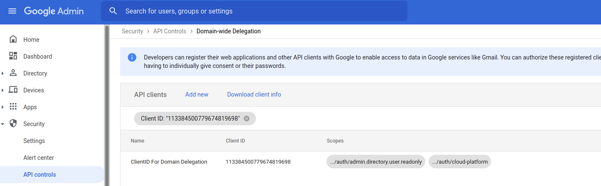

## Auditing users for IAM bindings outside of primarily Cloud Organization  

Sample script to  help identify which users within a [Cloud Organization](https://cloud.google.com/resource-manager/docs/quickstart-organizations) who have IAM bindings in projects or organizations outside of a primary cloud org.

For example, `Alice` is a member of Cloud Org `MyDomain`.  Alice has access to projects `A,B,C` within `MyDomain`. 

`Bob` creates a project `D` in Cloud Org `OtherDomain`. `Bob` grants IAM permissions to `Alice `to have access to project `D`.  If `Alice` accepts the invite from `Bob` to use project `D`, `Alice` now has access to a project outside of the primary cloud org domain.

In another situation, `Alice` may have created a project early on before the domain `MyDomain` was created.  Later on, an org admin will have to identify and [migrate projects](https://cloud.google.com/resource-manager/docs/project-migration) into the new domain, `MyDomain`.  

This script will help identify which _projects_ and _organizations_ a _user_ in a domain may have been granted access to external projects or organizations.  This will *not* identify direct permissions on resources _within_ a project (e.g. if `Bob` set a direct IAM grant to `Alice` on a GCS bucket that `Bob` owns).

Either way, please review [Restricting project visibility for users](https://cloud.google.com/resource-manager/docs/access-control-org#restricting_visibility) in combination with [VPC-SC](https://cloud.google.com/vpc-service-controls/docs/overview).

>> This is not an officially supported Google product

Please note that Google Cloud Support will not identify owners of projects not associated with your OrganizationID.

### How does it work?

This script will:

1. Enumerate all projects within a given cloud org.
2. Iterate all users within a Workspace domain tied to the cloud org.
3. For each user, use _user impersonation_ to identify which organizations they have access to.
4. For each user, use _user impersonation_ to identify which projects they have access to.
5. If the user has access to any other organization that's not in the subject org in #1, print that external org.
6. If the user has access to any other project thats not in the set in #1, print that external project.

For more information about Workspace domain delegation and _user impersonation_, see [Authentication Best Practices for Workspace APIs](https://static.googleusercontent.com/media/www.google.com/en//support/enterprise/static/gapps/docs/admin/en/gapps_workspace/Google%20Workspace%20APIs%20-%20Authentication%20Best%20Practices.pdf).

### Usage

To configure this script, you need to have access to act as

* [Google Cloud Platform Organization Admin](https://cloud.google.com/resource-manager/docs/access-control-org).
* [Google Workspace Domain Admin](https://support.google.com/a/answer/54693).

Once the permissions and configuration below is done, the script will run with ReadOnly/Viewer permissions to run the discovery.  These permissions are needed initially to configure the least-privilege IAM roles the script will ultimately use.

```bash
# select a project that will host the service account
export PROJECT_ID=`gcloud config get-value core/project`
export PROJECT_NUMBER=`gcloud projects describe $PROJECT_ID --format="value(projectNumber)"`
export DOMAIN_ADMIN=`gcloud config get-value core/account`

# acquire the organization ID
gcloud organizations list
	DISPLAY_NAME  ID            DIRECTORY_CUSTOMER_ID
	myDomain      673208786099  D123zw3x8

export ORGANIZATION_ID=673208786099

export CX=`gcloud organizations describe $ORGANIZATION_ID --format="value(owner.directoryCustomerId)"`

# create service account
gcloud iam service-accounts create dwd-sa

gcloud iam service-accounts describe dwd-sa@$PROJECT_ID.iam.gserviceaccount.com

# get the service account's clientID
export SA_CLIENT_ID=`gcloud iam service-accounts describe dwd-sa@$PROJECT_ID.iam.gserviceaccount.com --format="value(uniqueId)"`
echo $SA_CLIENT_ID

# enable impersonation instead of key-download and adapt the workspace AdminAPI to use the impersonated access token
gcloud iam service-accounts  add-iam-policy-binding \
  --role=roles/iam.serviceAccountTokenCreator \
  --member=user:$DOMAIN_ADMIN dwd-sa@$PROJECT_ID.iam.gserviceaccount.com

# Alternatively, you can download a key but this is _NOT_ recommended
# gcloud iam service-accounts keys create svc_account.json --iam-account=dwd-sa@$PROJECT_ID.iam.gserviceaccount.com

# Allow service account domain IAM privileges
#   http://cloud.google.com/asset-inventory/docs/access-control#required_permissions

gcloud organizations add-iam-policy-binding \
   --member=serviceAccount:dwd-sa@$PROJECT_ID.iam.gserviceaccount.com \
   --role=roles/cloudasset.viewer  $ORGANIZATION_ID
```

Cloud org Domain IAM Binding:

  

Navigate to the Google Workspace Console and enable [Domain Wide Delegation](https://developers.google.com/admin-sdk/directory/v1/guides/delegation)

Enter the `$SA_CLIENT_ID` for the service account and these _precise_  scopes

* `https://www.googleapis.com/auth/admin.directory.user.readonly`
* `https://www.googleapis.com/auth/cloud-platform.read-only`

Domain Delegation Scope permission:

  


Acquire Application Default Credentials for `$DOMAIN_ADMIN`

```bash
gcloud auth application-default login
```

Now run the utility

```bash
# with service account impersonation (preferred)
go run main.go --impersonatedServiceAccount=dwd-sa@$PROJECT_ID.iam.gserviceaccount.com \
  --subject=$DOMAIN_ADMIN \
  --organization $ORGANIZATION_ID \
  -cx $CX --alsologtostderr=1 -v 10


# with service account Key (not recommended)
# go run main.go --serviceAccountFile=svc_account.json \
#   --subject=$DOMAIN_ADMIN \
#   --organization $ORGANIZATION_ID \
#   -cx $CX --alsologtostderr=1 -v 10
```


The output will show all the projects in an org and for each user see if he/she has access to a project/org outside the domain

```log
I1003 09:59:32.852107  485974 main.go:213]              User [user10@mydomain.com] has external project visibility to [projects/919583951822](otherdomain-project-1)
I1003 09:59:33.214895  485974 main.go:213]              User [user4@mydomain.com] has external project visibility to [projects/1071284184433](yetotherdomain-project-1)
I1003 09:59:33.252026  485974 main.go:147]              User [user10@mydomain.com] has external organization visibility to [organizations/479774786222](otherdomain)
```

Output logs are also written to file through [glog](https://pkg.go.dev/github.com/golang/glog) level logging package.  By default the `ERROR|INFO|etc` level logs are under `/tmp/` (eg `/tmp/main.INFO`).  Adjust the log verbosity with `-v` flag.

---


### Working with Quotas/Limits

Each API used by this script has different per-second rate limits

- [Cloud Asset API](https://cloud.google.com/asset-inventory/docs/quota)

- [Directory API](https://developers.google.com/admin-sdk/directory/v1/limits)

- [Cloud Resource Manager API](https://cloud.google.com/resource-manager/docs/limits)

The restrictive quota is for the Cloud Resource Manager

- `Read operations	Up to 10 reads per second. This includes reading projects, tags, and other resources, with the exception of folders.`

which would lead to errors if the quota rate isn't managed over the progressive duration of the audit:

```
googleapi: Error 429: Quota exceeded for quota metric 'List projects V1' and limit 'List projects V1 per minute' 
    of service 'cloudresourcemanager.googleapis.com' for consumer 'project_number:1111111'., rateLimitExceeded
```

There are several ways to work with this:

- Sleep: a `sleep` is applied per User thats evaluated

```golang
delay                      = flag.Int("delay", 1*1000, "delay in ms for each user iterated")

time.Sleep(time.Duration(*delay) * time.Millisecond)
```

- Throttling: all api calls for the resource managers is capped using `"golang.org/x/time/rate"`

```golang
	maxRequestsPerSecond float64 = 4 // "golang.org/x/time/rate" limiter to throttle operations
	burst                int     = 1
```

which within the iteration to get the list of projects and organization:

```golang
	req := crmService.Projects.List().Filter(noFilter).PageSize(maxPageSize)
	err := req.Pages(ctx, func(page *cloudresourcemanager.ListProjectsResponse) error {
		projects = append(projects, page.Projects...)
		if err := limiter.Wait(ctx); err != nil {
			glog.Errorf("Error in rate limiter for user %s %v", u.PrimaryEmail, err)
			return err
		}
		return nil
	})
	if err != nil {
		glog.Errorf("Error iterating visible projects for user %s %v", u.PrimaryEmail, err)
		return nil, err
	}

	for _, p := range projects {
		glog.V(50).Infof("             User %s has Project visibility to %s", u.PrimaryEmail, p.ProjectId)
		if _, ok := allProjects[p.ProjectId]; !ok {
			glog.V(2).Infof("             User [%s] has external project visibility to [projects/%d](%s)", u.PrimaryEmail, p.ProjectNumber, p.ProjectId)
		}
	}
```

It is recommended to not alter these defaults.  They have been empirically tested to stay within the quota limits and benchmarked with 

* 1584 users within the org.
* 4623 projects with in the org.
* took ~25min runtime.

If you still see rate errors, reduce `maxRequestsPerSecond` and increase `delay`

The other approach which is not implemented here is to shard the requests between N projects.

That is, create several different "host" projects each with their own service accounts.  Then run the scripts in parallel with different impersonated service accounts. 
Each "shard" that runs a script iterates over a smaller set of user.  For example, 

1. create three host project `A`,`B`,`C`.
2. create three service accounts within those project `SA`, `SB`, `SC`.
3. run three versions of the audit scripts using different projectIDs and ServiceAccounts.
4. each 'version' of the audit script iterates over a subset of the domain accounts.

   - `SA` iterates of users `"A->H"`.
   - `SB` iterates over `"I->P"`.
   - `SC` iterates over `"Q->Z"`.

This technique will shard the api quota rate limits between each of the host projects

Another TODO: to use the same script but initialize using `N` service account from `N` projects.  Then for each users `projects.list()` call, select a random serviceAccount.